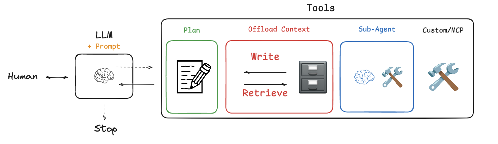

# Langchain Deep Agents Project

## Context

When AI agents first took off, they were mostly used for coding and stuff like LangChain's [Deep Research](https://academy.langchain.com/courses/deep-research-with-langgraph). Now, we're seeing general-purpose agents step up to handle pretty much anything. A great example is [Manus](https://manus.im/blog/Context-Engineering-for-AI-Agents-Lessons-from-Building-Manus), which has been getting a lot of hype for knocking out really long, complex tasks (averaging around 50 tool calls a run!). Claude Code is also branching out way beyond just writing software.

If you dig into the [context engineering patterns](https://docs.google.com/presentation/d/16aaXLu40GugY-kOpqDU4e-S0hD1FmHcNyF0rRRnb1OU/edit?slide=id.p#slide=id.p) making these agents tick, you'll see a few common tricks:

* **Task planning:** Making TODO lists and constantly reminding themselves of the end goal.
* **File system offloading:** Dumping context into local files so the prompt doesn't get overloaded.
* **Sub-agent delegation:** Spinning up smaller agents to handle specific pieces of the puzzle without getting distracted.

